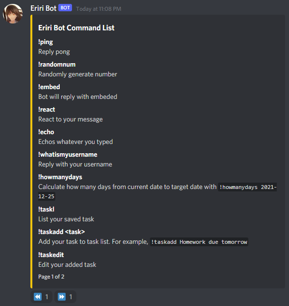
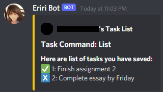
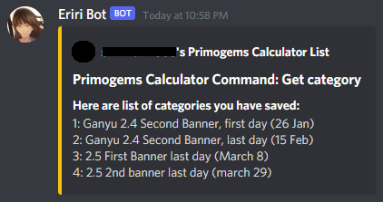
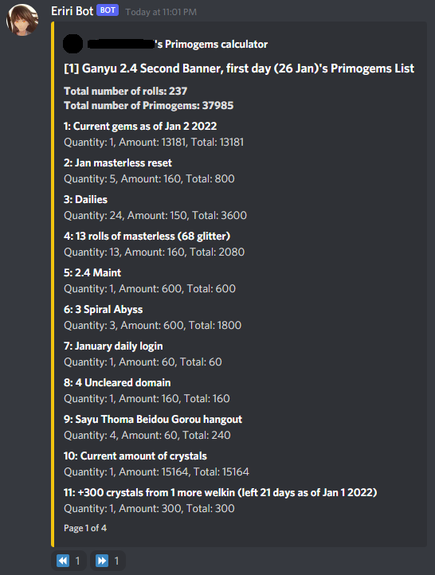

# Eriri Bot
Eriri Bot is a personalized discord bot. The bot is made with Discord JS and MongoDB as database, with the bot being hosted with Heroku.


## Features

Eriri Bot allows user to store task list within the bot, and contains primogems calculator for the game Genshin Impact.

## Commands

Eriri Bot contains the following commands:
- `!help` - Shows a complete list of commands
- `!ping` - Reply pong
- `!randomnum` - Randomly generate number
- `!embed` - Bot will reply with embeded
- `!react` - React to your message
- `!echo` - Echos whatever you typed
- `!whatismyusername` - Reply with your username
- `!howmanydays` - Calculate how many days from current date to target date with `!howmanydays 2021-12-25`
- `!helpgems` - Get a list of commands for primogems calculator

This is how `!help` command looks like:



<br/>

In addition to the above command, the bot also contains task and primogems calculator commands.

### Task

Task allows user to show list of tasks saved, add new task, edit task, delete added task, clear all tasks, mark task as complete or incomplete.

The following is the list of commands:

- `!taskl` - List your saved task
- `!taskadd <task>` - Add your task to task list. For example, !taskadd Homework due tomorrow
- `!taskedit` - Edit your added task
- `!taskdel` - Delete your saved task
- `!taskclear` - Delete all your saved tasks
- `!taskcomplete` - Mark a task as completed
- `!taskincomplete` - Mark a task as incomplete

This is how `!taskl` command looks like:



<br/>

### Primogems Calculator

Primogems Calculator allows user to calculate the amount of cumulative primogems the users will have by adding all the individual calculations within a category. The calculator can make it easier for users to plan primogems (a game currency) within Genshin Impact.

- `!gemsaddcategory <category name>` - Adds a new calculation category
- `!gemscategory` - Get a list of categories saved
- `!gemseditcategory` - Edit category name
- `!gemsdeletecategory` - Delete category
- `!gemsclearcategory` - Clear all categories added
- `!gemsaddcalculation <category number> <quantity> <amount> <description>` - Add calculation to the category
- `!gemseditcalculation <category number> <calculation number> <quantity> <amount> <description>` - Edit added calculation within the category
- `!gemsdeletecalculation` - Delete added calculation within the category
- `!gemsclearcalculation` - Clear all added calculations within the category
- `!gemscalculate` - Calculate the total amount of gems within a category
- `!gemslist` - Display all your saved categories and calculations in page format
- `!gemslistall` - Display all your saved categories and calculations
- `!gemscopy` - Copy your existing calculations from 1 category into new category

This is how `!gemscategory` command looks like:



Within each category, users can add calculations.
This is how `!gemslist` command looks like:



The bot will automatically calculate each category for the user.

## How to install

Create an .env file in the project root folder. Edit the DISCORD_TOKEN's `<token>` and MONGO_URI's `<url>` field with your own discord token and MongoDB URL. The .env file should be added to gitignore (it has already been done) as the information in .env should not be shared.

```
DISCORD_TOKEN=<token>
MONGO_URI=<url>
```

Node.js should be installed. After installing, use `npm install`  under the project root folder to install the dependencies.

To start the bot, use `npm start` or `nodemon start`.